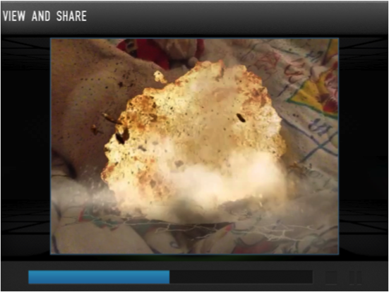

# Añadir efectos especiales mediante aplicaciones

Las apps de edición de vídeo como [QuoFX Video (IOS)](https://itunes.apple.com/us/app/quo-movie-fx-lights-camera/id551994210?mt=8) o [Action Movie](https://itunes.apple.com/es/app/action-movie-fx/id489321253?mt=8) (IOS) permiten añadir efectos especiales.

Se elige el tipo de efecto de una lista de opciones (un dinosaurio en la escena, un terromoto, una explosión, etc.) y luego se graba un vídeo en el que ese efecto se proyecta mediante realidad aumentada dentro de la escena. La película se guarda en la galería del dispositivo móvil y puede añadirse a un vídeo previo usando una app de edición como [VidTrim para Android](https://play.google.com/store/apps/details?id=com.goseet.VidTrim), o con programas como Kdenlive, iMovie o Windows Movie Maker.

