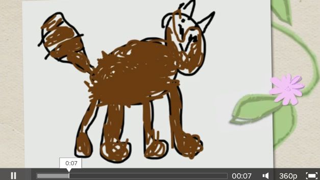

# Apps de narración digital en formato web

Algunas aplicaciones tienen también una versión web de forma que, una vez registrados, podemos crear tanto en el dispositivo móvil como en la web y lo que creemos en una plataforma se muestra también en la otra. El profesorado que se sienta inseguro al utilizar aplicaciones móviles puede empezar utilizando la web para sus primeros proyectos; también podría utilizar la web para gestionar las creaciones del alumnado mientras estos utilizan las app para crear sus historias digitales. La ventaja de utilizar el dispositivo móvil es que el alumnado puede crear sus historias más rápido que en la web; abren la app, capturan el vídeo o la fotografía, seleccionan opciones de la biblioteca, organizan la historia y hacen clic para enviar. Luego, cuando se conectan a internet, pueden sincronizar su historia para que aparezca en la web.

Un ejemplo de este tipo de aplicación es [Animoto](http://animoto.com/), que tiene una app gratuita para Android e IOS además de la herramienta web. Subimos hasta diez imágenes, elegimos un audio de la biblioteca (hay muchas canciones a elegir de Creative Commons), elegimos fondos y transiciones, añadimos textos o vídeos breves y hacemos clic en un botón para crear un vídeo de 30 segundos que puede incrustarse en un blog o página web. Abajo mostramos una captura de un vídeo creado con dibujos que un alumno había hecho con la app gratuita Drawing Torch. Siendo un alumno con Asperger, crear esta historia con este tipo de herramientas le ayudó a adquirir confianza en sí mismo y mejorar su habilidad para expresarse. Podéis acceder al vídeo [aquí](http://animoto.com/play/iWl3MeXza7gC5EQHTrQufw).  

 

Captura del vídeo [Tad the Cat video](http://animoto.com/play/iWl3MeXza7gC5EQHTrQufw) creado por un alumno con Asperger