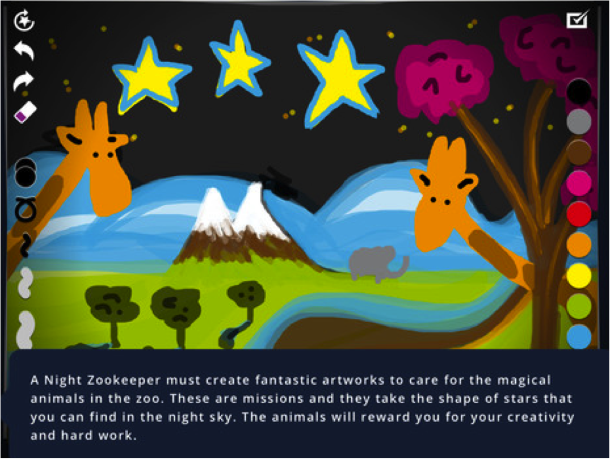

# Apps de narración digital para crear experiencias

Algunas aplicaciones sumergen al alumnado en una historia y les permiten experimentar y alterar sus elementos. Estas apps comienzan con una historia de fondo y luego invitan al alumnado a interactuar con sus elementos jugando, moviendo objetos o participando en la historia con una imagen o un dibujo. Un ejemplo es la app [Night Zookeeper Drawing Torch](https://itunes.apple.com/us/app/night-zookeeper-drawing-torch/id573502313?mt=8), una app gratuita para iPad con versión web que cuenta la aventura de un vigilante nocturno del zoo. El alumnado se convierte en aprendiz de vigilante nocturno y participa en la creación de misiones creativas para buscar miles de animales mágicos y derrotar a los monstruos que atacan el zoo. Sus características incluyen nueve herramientas de dibujo como el relleno, la mezcla de colores o diversos tamaños de pincel, así como la posibilidad de compartir por correo electrónico y 22 misiones. La historia se narra con texto, escenas animadas y audio. [En la versión web](http://www.nightzookeeper.com/), podemos encontrar además desarrollos didácticos para actividades a corto plazo o proyectos más largos.

 

Captura de la app [Night Zookeeper Drawing Torch](https://itunes.apple.com/us/app/night-zookeeper-drawing-torch/id573502313?mt=8)