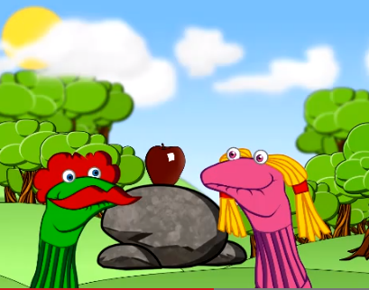

# Apps de narración digital que trabajan sin conexión

Muchas aplicaciones pueden utilizarse sin conexión una vez descargadas, como [SockPuppets IOS,](https://itunes.apple.com/us/app/sock-puppets/id394504903?mt=8) que permite al alumnado crear un corto protagonizado por títeres de calcetín. Esta app incluye una biblioteca de escenas, objetos (algunos animados) y unos cuantos personajes. Aquí podéis ver una captura de pantalla de una historia creada con esta app y el [vídeo completo](http://www.youtube.com/watch?v=qlq1rh2YMW0).

Captura del vídeo [The Apple Sockpuppet](http://www.youtube.com/watch?v=qlq1rh2YMW0)

La app [StoryKit](http://iphone.childrenslibrary.org/) permite crear un libro multimedia editando, reescribiendo y adaptando libros clásicos como _Los tres cerditos_ o creando libros propios. Nuestro alumnado podrá dibujar con la app, subir imágenes, grabar su voz y añadir texto. Aquí podéis [ver una historia historia creada con esta app](http://iphone.childrenslibrary.org/cgi-bin/view.py?b=djiqczblv4vnksculd4r).