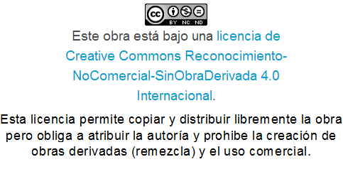

# Ciudadanía digital

Como hemos dicho anteriormente, la narración digital implica remezclar contenido creado por otros. Parte de la ciudadanía digital es el uso responsable de las imágenes de la red, así que los alumnos deben aprender a respetar los derechos de autor y a identificar dónde han obtenido las imágenes que utilizan. Las licencias Creative Commons se han convertido para mucha gente en una forma sencilla de definir cómo deben ser usadas sus imágenes y otros trabajos. El autor del contenido puede utilizar la [herramienta de licencias gratuitas](https://creativecommons.org/choose/) de la organización Creative Commons para elegir la mejor licencia, de forma que se genera una imagen y un texto que podrá publicar junto al contenido. Esta imagen muestra una posible licencia Creative Commons y si miras en la parte inferior, verás también la licencia bajo la que se ha publicado este curso:

La organización [Creative Commons](https://creativecommons.org/) ha creado [este cómic para explicar los derechos de autor a los alumnos](https://wiki.creativecommons.org/wiki/Sharing_Creative_Works).(en inglés).

<a title="View Sharing Creative Works (Creative Commons) on Scribd" href="https://www.scribd.com/document/2227656/Sharing-Creative-Works-Creative-Commons#from_embed"  style="text-decoration: underline;">Sharing Creative Works (Cre...</a> by  on Scribd
<iframe class="scribd_iframe_embed" title="Sharing Creative Works (Creative Commons)" src="https://www.scribd.com/embeds/2227656/content?start_page=1&view_mode=scroll&show_recommendations=true&access_key=key-1fexe7nmaykd7v62xiwe" data-auto-height="true" data-aspect-ratio="null" scrolling="no" width="100%" height="600" frameborder="0"></iframe> 
  
También puedes ver una explicación de estas licencias en formato cómic en el blog de [Carlos Solís.](https://azkware.files.wordpress.com/2010/08/nerdson216es.png) Generalmente el permiso de uso de imágenes va desde el dominio público (cualquiera puede usarlo) a imágenes con copyright que requieren permiso de uso. Las licencias Creative Commons garantizan permiso por adelantado y todas ellas incluyen la atribución, lo que significa que siempre debe darse crédito al autor.

