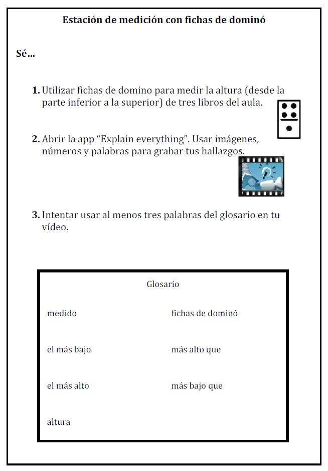

# Creación de material de apoyo para las actividades con dispositivos móviles

En nuestras aulas, trabajamos con alumnado de diversas capacidades y necesidades. El alumnado con trastornos como la dilexia, el déficit de atención o el Asperger puede beneficiarse del uso de dispositivos móviles para mejorar en sus habilidades de expresión a la vez que aprende contenidos teóricos. Los dispositivos móviles les proporcionan diversas opciones para ver, procesar, contextualizar y transformar el conocimiento; les permiten utilizar sus dedos, voces y manos; les invitan a moverse para capturar contenido y remezclarlo de forma que muestre que han aprendido.

Nuestro alumnado con dificultades, sin embargo, podría necesitar apoyo e indicaciones extra para comprender las instrucciones. Una forma de ayudarles a comprender estas instrucciones es utilizar [las fichas _I can..._](http://www.mrswideen.com/2012/11/using-ipads-during-math-stations.html) (_Sé..._), desarrolladas por [Kristen Wideen](https://twitter.com/mrswideen), una profesora canadiense. Estas fichas proporcionan al alumnado instrucciones paso a paso que se apoyan en imágenes y se complementan con un glosario. Aquí se muestra un ejemplo y la [plantilla de una ficha _I can_](https://docs.google.com/document/d/10zj-Idxv_liRgfr72b4os3tcvRZSHs7aE9rMd1OiHgk/edit?usp=sharing) (en castellano) que podéis reutilizar libremente.  

 

Adaptación de una  [I Can card de Kristen Wideen](http://www.mrswideen.com/2012/11/using-ipads-during-math-stations.html)