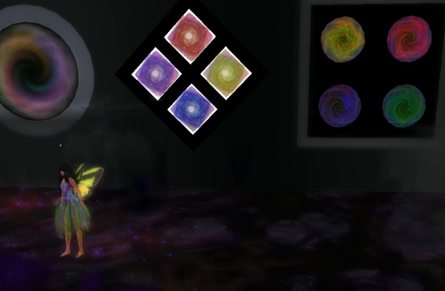
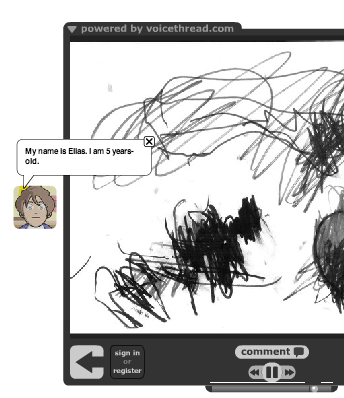

# Creación de nuestras identidades digitales: los avatares

Una forma de proteger a nuestro alumnado en la red es hacer que creen avatares, representaciones gráficas de sí mismos. Esta actividad no solo anima a los alumnos a desarrollar su identidad digital sino también a reflexionar sobre ella y sobre su huella digital. Por ejemplo, un profesor de Salud pidió a sus alumnos adolescentes que crearan avatares y luego reflexionaran sobre cómo habían manipulado su apariencia física en ellos; los jóvenes vieron que habían hecho a su yo digital más delgado, con diferente color de pelo, etc. (Boss, 2009)

Además, en muchos videojuegos el primer paso consiste en crear un avatar, así que los alumnos lo reconocerán como una forma de unirse a una comunidad digital y comenzar su viaje, un indicador de que participarán en una exploración digital. Según Taylor (2010), _"Los alumnos también crean sus propios avatares que "se llevan" con ellos mientras exploran páginas web o juegos de realidad virtual en la red. Estos avatares les permiten cruzar el portal hacia el mundo de la red de forma que puedan obtener experiencia de primera mano en lugar de escuchar una conferencia de forma pasiva."_

Otro beneficio está en que el alumnado pueda experimentar su aprendizaje con avatares. Los lectores con dificultades no siempre visualizan lo que leen pero con un avatar pueden experimentar el aprendizaje de diversas formas que les ayuden a contextualizar el aprendizaje. Trans (2010) afirma _"cuando los alumnos utilizan sus avatares para explorar el mundo virtual, tienen acceso una gran cantidad de conocimiento. Cuando entran en un Imperio Romano, por ejemplo, los avatares pueden reconstruir famosos monumentos romanos como el Coliseo o el Panteón. Los alumnos pueden estudiar los detalles arquitectónicos, las características de las ropas o la cultura de las gentes romanas. Los profesores pueden variar instantáneamente las realidades virtuales cambiando del modo histórico al arqueológico y ahora los alumnos exploran Roma de nuevo, esta vez con diferentes objetivos de aprendizaje y resultados."_

Una forma en que los estudiantes pueden usar avatares para experimentar lo que aprenden es crear una _machinima_, o grabación de pantalla de sus aventuras o acciones en un mundo virtual, como [este creado por Shelly Terrell](https://vimeo.com/15915055) para explorar los diversos aspectos de una exhibición artística en Second Life (a continuación se presentan capturas de pantalla del avatar, Rainey, y de la _machinima_). Podemos usar herramientas como [Jing](http://www.techsmith.com/jing.html) o [Camtasia](http://www.techsmith.com/camtasia.html) para crear estas _machinimas_. 

Captura de la _machinima_ [Quadrapop Black Build in Second Life for Slanguages 2010](http://vimeo.com/15915055), por Shelly Sanchez Terrell

Captura de la _machinima_, [Quadrapop Black Build in Second Life for Slanguages 2010](http://vimeo.com/15915055), por Shelly Sanchez Terrell 

El profesorado puede hacer que su alumnado cree avatares que les representen en diversos proyectos digitales. Los alumnos de 4 a 6 años de Shelly Terrell crearon sus identidades digitales con [DoppelMe](http://www.doppelme.com/), dieron a sus avatares unos alias y realizaron un proyecto en que presentaron estos avatares al resto de la clase. También usaron sus DoppleMes en lugar de su imagen real cuando crearon [proyectos con Voicethread](https://voicethread.com/share/558117/), de forma que las familias veían que la identidad de los alumnos estaba protegida. 

 Captura del [proyecto de narración digital en Voicethread](https://voicethread.com/share/558117/): _The German, Turkey, and New Zealand Animal Story_

Hay muchas páginas gratuitas de creación de avatares para los alumnos, como los ejemplos que se ofrecen en la siguiente lista. Al decidir cuál utilizar, debemos pensar en la edad de nuestro alumnado y la finalidad de la creación del avatar. 

*   [Web Tools for Kids](https://sites.google.com/site/webtoolsbox/avatars)\- Clasifica los avatares en nueve categorías y proporciona ejemplos. 
*   [Galería Avatares en Symbaloo](https://formacionintef.symbaloo.com/mix/avatares3)-  Un webmix de creadores de avatares. Simplemente haced clic y os llevarán a la página deseada.

**Contar historias **

Se puede pedir a los alumnos que cuenten un hecho histórico o representen e ilustren un hecho de un texto, de forma que el avatar deberá representar un personaje o figura histórica. En este caso, se podrían utilizar herramientas como [GoAnimate](http://goanimate.com/), [Voki](http://www.voki.com/), o [Creaza](http://www.creazaeducation.com/), que tienen una galería de personajes famosos. 

En [este otro Symbaloo](https://formacionintef.symbaloo.com/mix/creaciondecomic1), podréis encontrar más herramientas de creación de cómics. 

	

	

	

		

	

						

							

							

							

							

							

							

							

							

							

							

							

							

							

							

							

							

							

							

							

							

							

							

							

							

							

							

							

							

							

							

							

							

							

							

							

							

							

							

							

							

							

							

							

							

							

							

							

							

							

							

							

							

							

							

							

							

							

							

							

							

					

						<a id="smark-374967842" class="smark smark-color-white  col0 row0  link" title="Pixton | Comics " rel="nofollow" href="https://www.pixton.com/es/" data-id="374967842" data-smarkdefinition="122" data-url="https://www.pixton.com/es/" draggable="false"> 
			Pixton | Comics 
					</a>
	<a id="smark-374967863" class="smark smark-color-blue  col1 row0  link" title="Witty Comics - Make a Comic" rel="nofollow" href="http://www.wittycomics.com/make-comic.php" data-id="374967863" data-smarkdefinition="122" data-url="http://www.wittycomics.com/make-comic.php" draggable="false"> 
			Witty Comics - Make a Comic
					</a>
	<a id="smark-374967864" class="smark smark-color-white  col0 row1  link" title="CultureStreet " rel="nofollow" href="https://www.culturestreet.org.uk/activities/superactioncomicmaker/" data-id="374967864" data-smarkdefinition="122" data-url="https://www.culturestreet.org.uk/activities/superactioncomicmaker/" draggable="false"> 
			CultureStreet 
					</a>
	<a id="smark-374967851" class="smark smark-color-orange  col2 row0  link" title="ToonDoo" rel="nofollow" href="http://www.toondoo.com/" data-id="374967851" data-smarkdefinition="22817" data-url="http://www.toondoo.com/" draggable="false"> 
			</a>
	<a id="smark-374967846" class="smark smark-color-white  col1 row1  link" title="Myths and Legends from E2BN" rel="nofollow" href="http://myths.e2bn.org/" data-id="374967846" data-smarkdefinition="122" data-url="http://myths.e2bn.org/" draggable="false"> 
			Myths and Legends from E2BN
					</a>
	<a id="smark-374967856" class="smark smark-color-orange  col3 row0  link" title="Comics Lab" rel="nofollow" href="http://www.professorgarfield.org/pgf_comics_lab.html" data-id="374967856" data-smarkdefinition="122" data-url="http://www.professorgarfield.org/pgf_comics_lab.html" draggable="false"> 
			</a>
	<a id="smark-374967850" class="smark smark-color-white  col2 row1  link" title="Create A Comic" rel="nofollow" href="http://www.makebeliefscomix.com/" data-id="374967850" data-smarkdefinition="122" data-url="http://www.makebeliefscomix.com/" draggable="false"> 
			Create A Comic
					</a>
	<a id="smark-374967866" class="smark smark-color-white  col4 row0  link" title="Comicshead" rel="nofollow" href="https://www.comicshead.com/" data-id="374967866" data-smarkdefinition="122" data-url="https://www.comicshead.com/" draggable="false"> 
			Comicshead
					</a>
	<a id="smark-374967848" class="smark smark-color-white  col3 row1  link" title="Arthur Comic Creator" rel="nofollow" href="http://pbskids.org/arthur/games/comiccreator/comiccreator.php" data-id="374967848" data-smarkdefinition="122" data-url="http://pbskids.org/arthur/games/comiccreator/comiccreator.php" draggable="false"> 
			</a>
	<a id="smark-374967849" class="smark smark-color-cyan  col1 row3  link" title="Zoodle App for IOS Free" rel="nofollow" href="https://itunes.apple.com/us/app/zoodle-pad/id439412351?mt=8" data-id="374967849" data-smarkdefinition="122" data-url="https://itunes.apple.com/us/app/zoodle-pad/id439412351?mt=8" draggable="false"> 
			Zoodle App for IOS Free
					</a>
	<a id="smark-374967854" class="smark smark-color-white  col0 row4  link" title="piZap ios Comic" rel="nofollow" href="https://itunes.apple.com/us/app/pizap/id642936943?mt=8" data-id="374967854" data-smarkdefinition="122" data-url="https://itunes.apple.com/us/app/pizap/id642936943?mt=8" draggable="false"> 
			piZap ios Comic
					</a>
	<a id="smark-374967858" class="smark smark-color-white  col5 row0  link" title="Online Speech Bubble" rel="nofollow" href="http://phrase.it/" data-id="374967858" data-smarkdefinition="122" data-url="http://phrase.it/" draggable="false"> 
			Online Speech Bubble
					</a>
	<a id="smark-374967843" class="smark smark-color-black  col4 row1  link" title="PLAYCOMIC" rel="nofollow" href="http://ntic.educacion.es/w3//eos/MaterialesEducativos/mem2009/playcomic/index_es.html" data-id="374967843" data-smarkdefinition="122" data-url="http://ntic.educacion.es/w3//eos/MaterialesEducativos/mem2009/playcomic/index_es.html" draggable="false"> 
			PLAYCOMIC
					</a>
	

			
<!--?xml version="1.0" encoding="UTF-8"?-->

	<form action="/search" method="GET" target="_blank" class="web" id="cse-search-box" name="web">
		<input type="text" name="q" value="" id="g-search-new" autocomplete="off" placeholder="Buscar la web">
		

			

		

		<!-- custom search -->
		<input type="hidden" name="cof" value="FORID:11">
		<input type="hidden" name="hl" value="es">
		<input type="hidden" name="ie" value="UTF-8">
		<input type="hidden" name="cx" value="partner-pub-0319093145577670:3513366911">
		<input type="submit" name="sa" value="Google search" id="new-submit">
	</form>
	<ul id="options">
		<li id="web" class="active">La web</li>
		<li id="images">Imágenes</li>
		<li id="maps">Mapas</li>
		<li id="tiles">Bloques</li>
		<li id="webmixes">Webmixes</li>
		<li id="news">Noticias</li>
	</ul>
	

		

	<a id="smark-374967865" class="smark smark-color-white  col1 row4  link" title="Comics Head LITE for iPad" rel="nofollow" href="https://itunes.apple.com/us/app/comics-head-create-your-own-comic/id480969185?mt=8" data-id="374967865" data-smarkdefinition="122" data-url="https://itunes.apple.com/us/app/comics-head-create-your-own-comic/id480969185?mt=8" draggable="false"> 
			Comics Head LITE for iPad
					</a>
	<a id="smark-374967869" class="smark smark-color-white  col6 row0  link" title="Storyboard That" rel="nofollow" href="http://www.storyboardthat.com/storyboard-creator" data-id="374967869" data-smarkdefinition="122" data-url="http://www.storyboardthat.com/storyboard-creator" draggable="false"> 
			Storyboard That
					</a>
	<a id="smark-374967859" class="smark smark-color-orange  col5 row1  link" title="ReadWriteThink: Student Materi" rel="nofollow" href="http://www.readwritethink.org/files/resources/interactives/comic/index.html" data-id="374967859" data-smarkdefinition="20956" data-url="http://www.readwritethink.org/files/resources/interactives/comic/index.html" draggable="false"> 
			</a>
	<a id="smark-374967839" class="smark smark-color-orange  col7 row0  link" title="CarTOON Maker" rel="nofollow" href="http://www.toon-books.com/cartoon-makers.html" data-id="374967839" data-smarkdefinition="122" data-url="http://www.toon-books.com/cartoon-makers.html" draggable="false"> 
			</a>
	<a id="smark-374967847" class="smark smark-color-white  col6 row1  link" title="Creaza" rel="nofollow" href="http://www.creaza.com/" data-id="374967847" data-smarkdefinition="122" data-url="http://www.creaza.com/" draggable="false"> 
				
			Creaza
					</a>
	<a id="smark-374967852" class="smark smark-color-white  col3 row4  link" title="Más generadores de cómics" rel="nofollow" href="https://sites.google.com/site/litebeo/generador-de-comics" data-id="374967852" data-smarkdefinition="122" data-url="https://sites.google.com/site/litebeo/generador-de-comics" draggable="false"> 
			Más generadores de cómics
					</a>
	<a id="smark-374967841" class="smark smark-color-red  col8 row0  link" title="WriteComics" rel="nofollow" href="http://writecomics.com/" data-id="374967841" data-smarkdefinition="122" data-url="http://writecomics.com/" draggable="false"> 
			</a>
	<a id="smark-374967840" class="smark smark-color-white  col7 row1  link" title="comiclife.com" rel="nofollow" href="http://comiclife.com/" data-id="374967840" data-smarkdefinition="122" data-url="http://comiclife.com/" draggable="false"> 
			comiclife.com
					</a>
	<a id="smark-374967862" class="smark smark-color-purple  col4 row4  link" title="Más creadores de cómic" rel="nofollow" href="http://www.livebinders.com/play/play_or_edit?id=41475" data-id="374967862" data-smarkdefinition="122" data-url="http://www.livebinders.com/play/play_or_edit?id=41475" draggable="false"> 
			Más creadores de cómic
					</a>
	<a id="smark-374967867" class="smark smark-color-white  col3 row5  link" title="Janet\'s ScoopIt Comics" rel="nofollow" href="http://www.scoop.it/t/comics-and-cartoons" data-id="374967867" data-smarkdefinition="122" data-url="http://www.scoop.it/t/comics-and-cartoons" draggable="false"> 
			Janet\'s ScoopIt Comics
					</a>
	<a id="smark-374967844" class="smark smark-color-green  col9 row0  link" title="Garfield's Comic Creator" rel="nofollow" href="http://garfield.com/fungames/comiccreator.html" data-id="374967844" data-smarkdefinition="122" data-url="http://garfield.com/fungames/comiccreator.html" draggable="false"> 
			</a>
	<a id="smark-374982523" class="smark smark-color-white  col8 row1  link" title="Comic Master" rel="nofollow" href="http://www.comicmaster.org.uk/" data-id="374982523" data-smarkdefinition="122" data-url="http://www.comicmaster.org.uk/" draggable="false"> 
			Comic Master
					</a>
	<a id="smark-374967860" class="smark smark-color-white  col5 row4  link" title="Creadores de avatares" rel="nofollow" href="https://www.symbaloo.com/mix/avatars19" data-id="374967860" data-smarkdefinition="122" data-url="https://www.symbaloo.com/mix/avatars19" draggable="false"> 
			Creadores de avatares
					</a>
	<a id="smark-374967845" class="smark smark-color-white  col4 row5  link" title="Comic Dissertation" rel="nofollow" href="http://www.spinweaveandcut.blogspot.com/" data-id="374967845" data-smarkdefinition="122" data-url="http://www.spinweaveandcut.blogspot.com/" draggable="false"> 
			Comic Dissertation
					</a>
	<a id="smark-487046723" class="smark smark-color-white  col9 row1  link" title="motioncomics.io" rel="nofollow" href="https://motioncomics.io/" data-id="487046723" data-smarkdefinition="122" data-url="https://motioncomics.io/" draggable="false"> 
			motioncomics.io
					</a>
	<a id="smark-374967855" class="smark smark-color-white  col8 row3  link" title="Comic &amp; Meme Creator - A" rel="nofollow" href="https://play.google.com/store/apps/details?id=com.tiltedchair.cacomic" data-id="374967855" data-smarkdefinition="122" data-url="https://play.google.com/store/apps/details?id=com.tiltedchair.cacomic" draggable="false"> 
			Comic &amp; Meme Creator - A
					</a>
	<a id="smark-374967861" class="smark smark-color-white  col8 row4  link" title="Comic Strip It! (lite)" rel="nofollow" href="https://play.google.com/store/apps/details?id=com.roundwoodstudios.comicstripit&amp;hl=en" data-id="374967861" data-smarkdefinition="122" data-url="https://play.google.com/store/apps/details?id=com.roundwoodstudios.comicstripit&amp;hl=en" draggable="false"> 
			Comic Strip It! (lite)
					</a>
	<a id="smark-374967868" class="smark smark-color-white  col9 row4  link" title="Comics Head LITE for Android! " rel="nofollow" href="https://www.comicshead.com/node/2955" data-id="374967868" data-smarkdefinition="122" data-url="https://www.comicshead.com/node/2955" draggable="false"> 
			Comics Head LITE for Android..
					</a>
	

				

