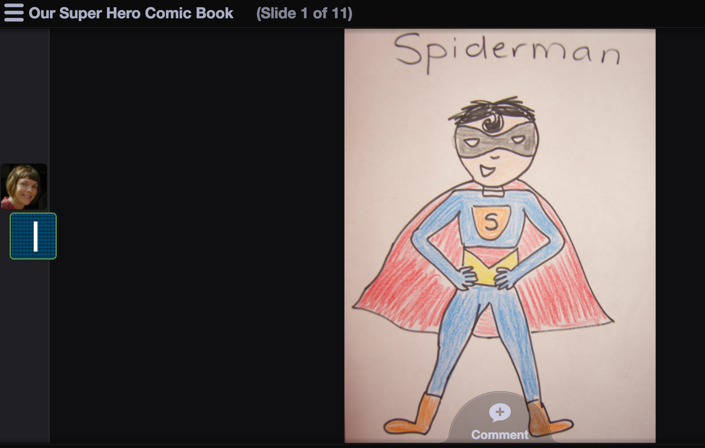

# Ejemplo 1. Narración digital cooperativa con alumnado joven

Michelle Worgan, profesora de inglés en Jerez de la Frontera, proporciona muchas buenas ideas y consejos para poner en marcha un proyecto narrativo cooperativo con el alumnado más joven (2013), así como ejemplos de estos proyectos en su artículo [Collaborating with Kids](http://inspireyourlearners.blogspot.com/2013/05/collaborating-with-kids-my-vrt.html). El [ejemplo de abajo ilustra una historia colaborativa de aula](http://voicethread.com/share/1867633/) (en inglés) sobre un superhéroe que salva a la población de un tsunami, en la que cada niña/o creaba un dibujo y narraba una parte de la historia. Michelle Worgan utiliza [Voicethread](http://voicethread.com/), una gran herramienta gratuita y app de IOS para profesores. Esta herramienta permite a los educadores crear cuentas para su alumnado sin utilizar el correo electrónico y ofrece diversos avatares para elegir. También es posible subir [imágenes, documentos y vídeos](http://voicethread.com/about/features/media/) que se convertirán en una presentación multimedia donde es posible navegar por las diapositivas y comentar de diversas formas: dejar notas de voz con un micrófono o por teléfono, crear texto, subir un archivo de audio, dejar un comentario con la cámara web o elegir un lápiz de colores para pintar sobre la presentación. El proyecto final puede incrustarse y permite muchas opciones de privacidad.  

Captura de pantalla de [la historia en Voicethread de la clase de Michele Clare](http://voicethread.com/share/1867633/)  

Podéis saber más sobre cómo organizar una historia colaborativa con alumnado joven en la presentación de Michelle Worgan [Collaborating with Kids! Setting Up Online Projects for Young Learners](http://www.slideshare.net/shelliscfc/collaborating-with-kids) y [leyendo su artículo con información detallada](http://inspireyourlearners.blogspot.com/2013/05/collaborating-with-kids-my-vrt.html) (en inglés).

Guardar

Guardar

Guardar

Guardar

Guardar

Guardar

Guardar

Guardar

Guardar

Guardar