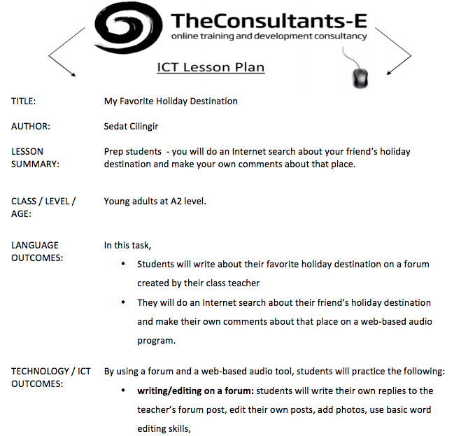

# Ejemplo 2. Narración en audio con dispositivos móviles

En esta actividad, el alumnado utiliza la app gratuita para IOS/Android [Audioboom](https://audioboom.com/ "audioboom") para dejar comentarios de audio sobre un destino vacacional. Debajo presentamos una captura de pantalla del desarrollo didáctico, que podéis ver al completo en la página de The Consultants-E.

Captura del desarrollo didáctico de la unidad: _Mi destino vacacional favorito_

