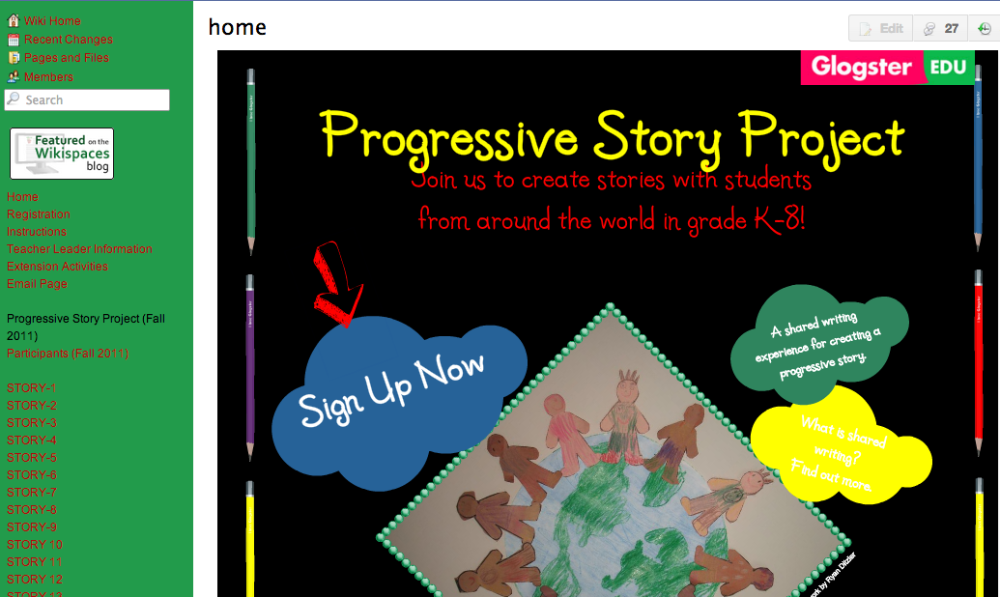
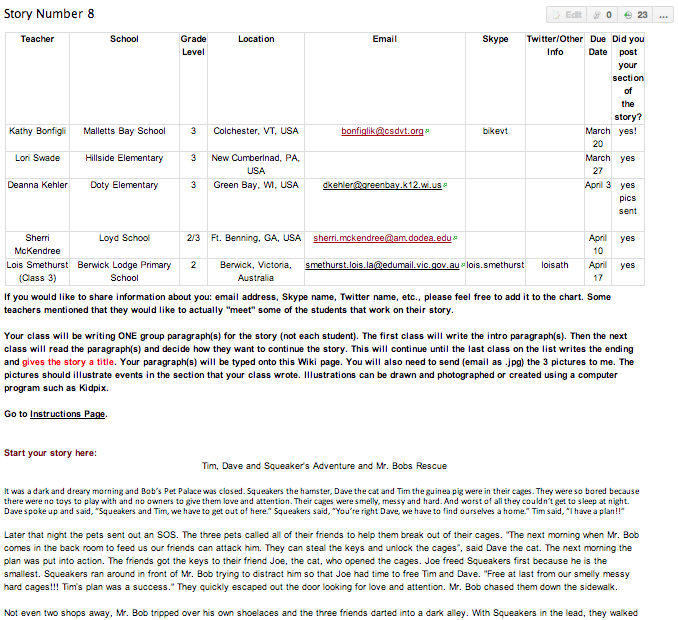
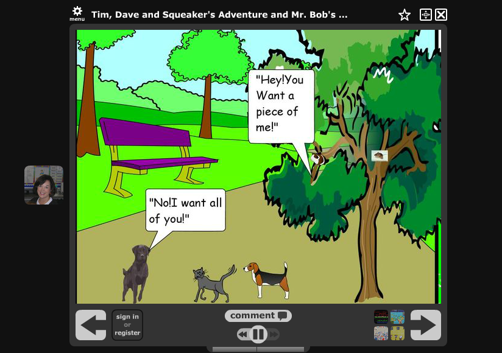

# Ejemplo 3. Proyecto de colaboración global

En este mundo tan digitalizado la colaboración, la creación y la resolución de problemas en la red se han convertido en algo fundamental. Nuestro alumnado puede adquirir estas habilidades si participa en proyectos de narración cooperativa con alumnado de otra ciudad, comunidad autónoma o país, ya que el hecho de trabajar a distancia les forzará a comunicarse y trabajar principalmente en red. Esta forma de trabajo es muy diferente a hacerlo en persona, ya que la colaboracion en red no contiene indicaciones no verbales que apoyen nuestros mensajes. Muchos investigadores piensan que [la comunicación no verbal supone del 60% al 93% de toda la comunicación](http://books.google.com/books?id=cTyajaSu_CIC&pg=PT139&dq=nonverbal+communication+%25+of+all+communication&hl=en&ei=uA_QTNaPG8aJ4Qb79K2dBg&sa=X&oi=book_result&ct=result&resnum=1&ved=0CCUQ6AEwAA#v=onepage&q=nonverbal%20communication%20%25%20of%20all%20communication&f=false) que realizamos (Wood, 2009). Esto significa que la mayoría de nuestros mensajes online podrían malinterpretarse y, sin embargo, gran parte de los jóvenes no suelen tener esto en cuenta. Cuando ofendemos a alguien accidentalmente cerramos las líneas de comunicación, lo que pone en peligro el resultado de nuestros esfuerzos.

A continuación se muestra un ejemplo del tipo de narración colaborativa en la red en la que nuestro alumnado podría participar. Daren Ditzler creó el proyecto de colaboración global [Progressive Story,](http://writeyourstory.wikispaces.com/) que tuvo lugar entre 2009 y 2011, en la que se crearon casi 200 historias en 5 continentes, 10 países, 29 estados y 289 aulas (Ditzler, 2011).

Captura del proyecto de colaboración global [Progressive Story](http://writeyourstory.wikispaces.com/), creada por Karen Ditzler

Se creó una wiki para almacenar las historias, dar instrucciones y cuadrar los detalles en la que cada alumno/a debía escribir su parte de la historia.

Captura de estudiantes de varios países escribiendo sus historias como un fragmento cooperativo (Ditzler, 2011)

Las wikis son sitios de colaboración que permiten que otras personas se unan y creen espacios para mostrar imágenes, vídeos, presentaciones, mapas, contenido incrustado, etc. También tienen un área de comentarios y un foro para permitir la retroalimentación, así como muchas apps que mejoran el espacio y lo hacen más atractivo. Además, el profesorado puede seguir los cambios, asignar roles de edición y establecer la configuración de privacidad. Estas opciones han hecho que esta sea una herramienta muy popular para la creación de proyectos de cooperación global, ya que en ellas alumnos y profesores se implican y pueden utilizar el sitio para organizar la historia y tener un espacio común donde subir sus aportaciones integrando otras herramientas. Karen, por ejemplo, pudo insertar los Voicethreads que mostraban todas las historias con multimedia, a las que podéis acceder [aquí](http://writeyourstory.wikispaces.com/Voicethreads2010).

Captura de [Voicethread Progressive Story: Tim, Dave and Squeaker's Adventure and Mr. Bobs Rescue](https://voicethread.com/share/1104530/) (Ditzler, 2011)

