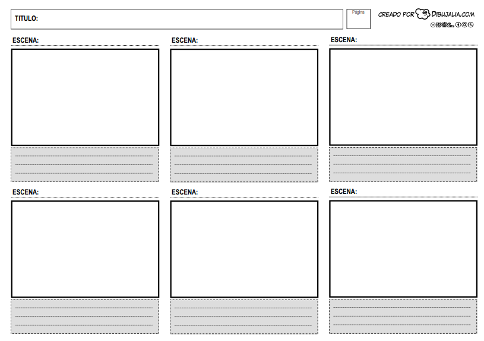
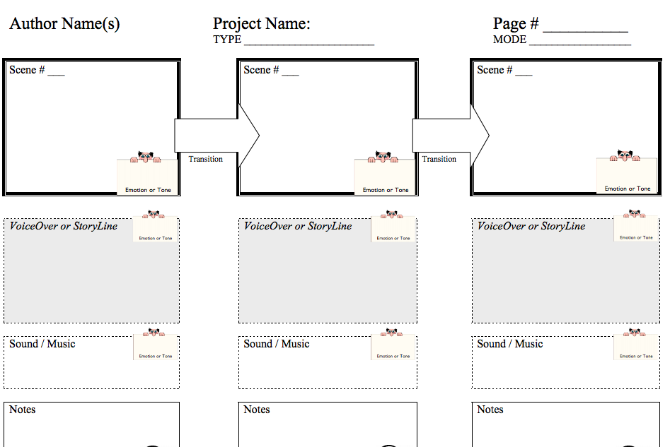

# El guion gráfico

Antes de crear sus vídeos, los alumnos deberían organizar sus historias mediante un guion gráfico (o _storyboard_), como forma de plasmar y perfeccionar su idea inicial. Este guion suele consistir en un organizador gráfico dividido en cuadros o viñetas que se completan con los detalles de la historia: música, personajes, diálogo, sonidos, narración, transiciones, texto, iluminación, efectos especiales, decorados, etc. Los guiones gráficos generan mayor estímulo para la creatividad e imaginación porque conectan mejor con la forma en que funciona nuestro cerebro; ver las ideas representadas ayuda a organizarlas a la vez que provoca nuevas ideas.

Cuando utilizamos los guiones gráficos en proyectos de vídeo con alumnado joven, podemos elegir hacer uno básico o perfectamente detallado. A la hora de decidir qué tipo de guion gráfico utilizar debemos tener en cuenta:

*   ¿Cuál es la edad de nuestro alumnado?
    

*   ¿Qué tipo de historia producirán?¿Crearán un vídeo de plastianimación, un corto o un vídeo musical? Cada uno de estos formatos requerirá incluir detalles distintos en nuestro guion.

En los enlaces de la sección anterior, Proyectos de narración en vídeo, podéis encontrar diversos ejemplos de guiones gráficos para cada tipo de proyecto, así como en [Bernadean Porter’s StoryKeepers’ wiki.](http://storykeepers.wikispaces.com/StoryBoarding) En esta página de [wikiHow](http://es.wikihow.com/crear-un-guion-gr%C3%A1fico-(storyboard)) podéis también ver el proceso descrito paso a paso.

Veamos cómo podría ser un guion gráfico para utilizar en primaria. El ejemplo de la imagen, creado por [dibujalia.com](http://www.dibujalia.com/blog/wp-content/uploads/2012/11/storyboard-cine-dibujalia.pdf), es un guion típico en el que se esboza cada escena y se añaden notas bajo cada una. Con un guion tan básico como este, el profesor necesitará guiar a sus alumnos más jóvenes, moviéndose por el aula mientras les hace preguntas que les ayuden a completar la información. Mientras ellos dibujan sus personajes podemos, por ejemplo, plantearles preguntas que refuercen el vocabulario a utilizar y los temas que deseamos que trabajen como "¿Es un niño o una niña?" "¿Tiene el pelo rubio o moreno?" "¿Dónde están los personajes?" "¿Cómo se sienten en ese momento?" "¿Hace frío o calor?" También pueden añadir notas explicando detalles que no se aprecien en el dibujo.

El siguiente guion gráfico multimedia, creado por Bernajean Porter, de la página [Digitales](http://www.digitales.us/), es más detallado, con fotogramas que hacen que los alumnos reflexionen sobre el sonido, la voz, la música y la historia de cada escena. El resultado será diferente al del ejemplo anterior.

Captura de pantalla del [Guion gráfico multimedia creado por Bernajean Porter](https://sps-newmedialiteracies.wikispaces.com/file/view/Multi-Media+StoryBoard+Template.pdf) de la página Digitales Site