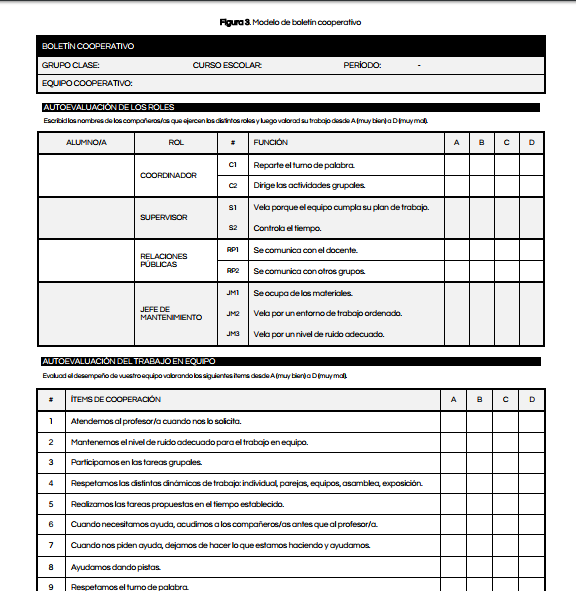

# Evaluación

A la hora de evaluar un proyecto de narración cooperativa, es interesante tener en cuenta las indicaciones de [este documento](http://www.colectivocinetica.es/media/cinetica_calificamos_cooperacion.pdf) creado por el [Colectivo Cinética](http://www.colectivocinetica.es), que incluye recomendaciones sobre cómo organizar el trabajo grupal y realizar una evaluación apropiada. 

Podemos evaluar las historias cooperativas mediante rúbricas y evaluaciones grupales, evaluación entre pares, etc. teniendo en cuenta no solo el contenido de la historia, sino también el funcionamiento del grupo, la aplicación de los roles establecidos y la realización de las tareas encomendadas. 

Captura del boletín cooperativo propuesto por el [colectivo Cinética](http://www.colectivocinetica.es/media/cinetica_evaluamos_funcionamiento_equipos.pdf)

*   [Rúbrica](http://ceipprincipefelipe.net/aulavirtual/mod/page/view.php?id=210) para el trabajo cooperativo
*   [Varias rúbricas para proyectos de Kathy Schrock](http://www.schrockguide.net/assessment-and-rubrics.html)
*   Formulario de autoevaluación y evaluación entre pares [para alumnado trabajando en grupo para la creación de un mito cultural](http://alex.state.al.us/lesson_view.php?id=30065) (la ficha está en el enlace) Dees, 2012.

Guardar

Guardar

Guardar