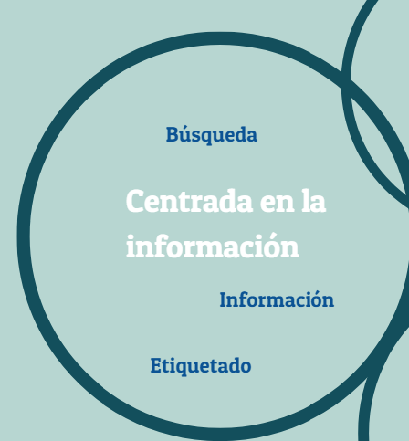

# Información

  

 

Ilustración 1.4 Esta imagen se ha adaptado de una similar perteneciente al libro _Digital Literacies_. Cita: Dudeney, G., N. Hockly, y M. Pegrum. (2013). _Digital Literacies._ Harlow: Pearson.

En la imagen, algunas de las palabras clave asociadas al área de información son "búsqueda" y "etiquetado". Muchos de nuestros alumnos utilizan Google para encontrar respuestas o contenidos digitales para sus proyectos; muchos de ellos dejarán la búsqueda ahí y aceptarán esa información. Debemos ayudar a nuestros alumnos a evaluar la calidad de la información que reciben.

Nuestros alumnos necesitan también desarrollar habilidades para curar, marcar, agregar y categorizar recursos y contenido que descubran en la red. Podemos mostrarles herramientas digitales gratuitas como [Diigo](https://www.diigo.com/), [Symbaloo](https://www.symbaloo.com), [PearlTrees](https://www.pearltrees.com/), [Livebinders](http://www.livebinders.com/) y [Delicious](https://del.icio.us/), que poseen diversas características que ayudan a los alumnos a encontrar el recurso en un momento posterior en que lo necesiten. Una de las formas en que estas herramientas organizan la información es a través de las etiquetas, que se pueden usar para clasificar la información y categorizarla. En este curso curaremos y marcaremos información con [Pinterest](https://www.pinterest.es/). 

Guardar

Guardar