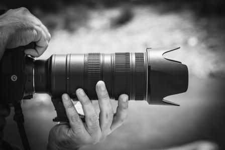

# Introducción

Contar historias mediante vídeos es muy motivador para los alumnos, además de permitirles moverse e interactuar con el mundo mientras crean sus historias. Tras la cámara, pueden observar la realidad de otra forma.

El profesorado puede ayudar a sus alumnos a desarrollar su ojo crítico y su capacidad de observación a través de la realización de proyectos en vídeo, puede hacer que vean el mundo de formas diferentes jugando con los filtros, la perspectiva y los efectos especiales; y puede hacer también que tengan en cuenta a su público cuando crean sus vídeos. 

Componer una historia de esta forma atrae a los alumnos al involucrarlesen la creación de material auténtico. Además, estimula las habilidades de comprensión y expresión oral y escrita. En este bloque exploraremos formas de crear vídeos con herramientas web y apps, así como varios tipos de proyectos de narración con vídeo. Veremos cómo crear vídeos sin necesidad de conexión a Internet y también cómo editarlos.