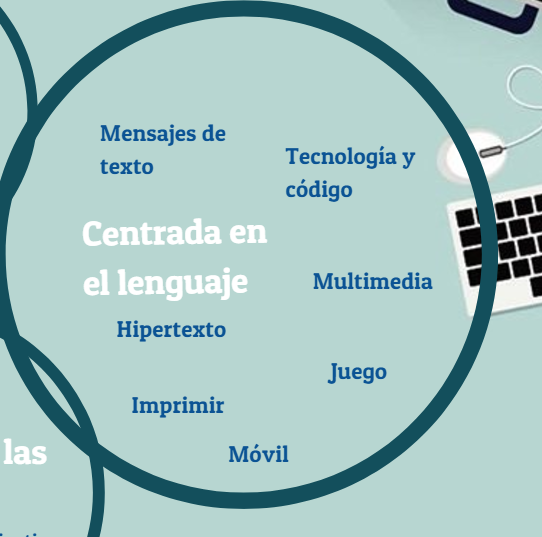

# Lenguaje

Ilustración 1\. 2 Esta imagen se ha adaptado de una similar perteneciente al libro _Digital Literacies_. Cita: Dudeney, G., N. Hockly, y M. Pegrum. (2013). _Digital Literacies._ Harlow: Pearson.

En la imagen, "mensajes de texto", "codificación" y "móvil" son algunas de las palabras clave asociadas al lenguaje. El objetivo de poner la tecnología en las manos miles de millones de personas en todo el mundo es ya una realidad. La tecnología se ha vuelto más pequeña, más disponible y más accesible para personas de todo el mundo. Antes los ordenadores eran grandes, pesados y toscos; accedíamos a ellos en escuelas, en bibliotecas y en el trabajo. Ahora miles de millones de personas llevan teléfonos móviles y muchos de nuestros alumnos tienen teléfonos inteligentes. La tecnología es parte de nuestras rutinas y costumbres, la llevamos con nosotros a diario y la usamos a menudo para divertirnos, comunicarnos con amigos y familia, realizar tareas laborales y mucho más. Nuestro lenguaje se ha adaptado al diseño de la tecnología para ayudarnos a comunicarnos con mayor rapidez: teclear en un móvil es muy diferente de escribir con un bolígrafo o tener una conversación en persona, las redes sociales como Twitter limitan el número de caracteres por mensaje, queremos ser capaces de escribir más rápido pero debemos hacerlo con un número limitado de palabras... Todos estos factores dan como resultado grandes cambios en nuestro lenguaje.

Más aún, hablar con dispositivos digitales implica que perdamos la posibilidad de leer el lenguaje corporal y escuchar patrones vocales y de entonación. Parte del significado se deriva de nuestro conocimiento de las emociones tras el lenguaje, así que expresiones como LOL o OMG se usan a menudo en los mensajes de texto para darnos pistas y los emoticonos se usan también en chats y actualizaciones de estado con el mismo objetivo. Muchas personas han adoptado ya estas adaptaciones de nuestra lengua de tal forma que ya estamos empezando a ver estos cambios en la lengua oral ([Crystal, 2009](http://www.youtube.com/watch?v=h79V_qUp91M)).

Guardar

Guardar

Guardar

Los alumnos deben darse cuenta de que el lenguaje y la comunicación cambian cuando utilizamos herramientas digitales. En primer lugar, hay una mayor probabilidad de confusiones porque no obtenemos información no verbal, lo que significa que deben evaluar lo que leen en la red y tomarse un tiempo en descodificar el significado. Nuestros alumnos deben también aprender a generar sus mensajes de forma que no sean entendidos de forma incorrecta.

Además, deben ser conscientes de que nos comunicamos de forma diferente en cada foro. Para comunicarnos de forma apropiada debemos conocer las idiosincrasias de ese lenguaje. "Hashtag", "RT", "MD" o símbolos como @ son componentes esenciales del lenguaje de Twitter (hace poco Facebook ha adoptado los "hashtags" en su propio lenguaje); los memes, las citas, los "me gusta" y "etiquetar" son parte del lenguaje de Facebook; "rebloguear" y "remezclar" son fundamentales en el lenguaje de Tumblr. 

Los alumnos deberían también conocer los diversos lenguajes que han surgido en el mundo digital, tales como diversos lenguajes de programación. La creación con herramientas digitales implica que nuestros alumnos deban conocer estos lenguajes para poder utilizar la app o la herramienta que genere lo que han imaginado. En este curso, por ejemplo, los participantes aprenderán a "incrustar" las tareas que completen.