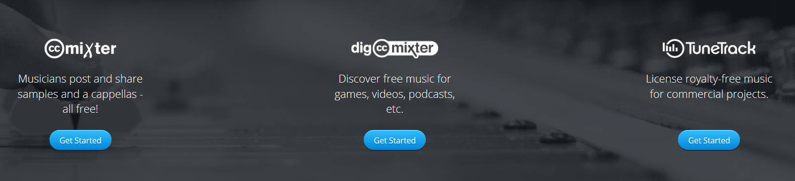

# Páginas donde encontrar música e imágenes de Creative Commons

Aquí encontrarás una selección de páginas que te ayudarán en la selección de este tipo de archivos. Encontrarás mucha más información sobre el uso de licencias y páginas de recursos en el [Kit digital](http://formacion.educalab.es/mod/imscp/view.php?id=39677) y en este [webmix](https://formacionintef.symbaloo.com/mix/creativecommons19) con recursos Creative Commons.

### Imágenes

*   [Wikimedia Commons](http://commons.wikimedia.org/wiki/Main_Page) \- 4 millones de imágenes de dominio público.
*   [Compfight](http://compfight.com/) \- Busca fotos de Flickr para tus vídeos.
*   [MorgueFile](http://www.morguefile.com/) \- Encuentra imágenes libres para tus vídeos.
*   [Free Images](http://www.freeimages.co.uk/) \- 6000 fotos que requieren que se cite a la página como fuente.
*   [ELT Pics](http://www.flickr.com/photos/eltpics/) \- Imágenes tomadas por profesores, recogidas vía Twitter y almacenadas en Flickr bajo licencia CC NoComercial.
*   [PhotoPin](http://photopin.com/) \- Un motor de búsqueda que encuentra imágenes de Creative Commons.
*   [Wylio](http://www.wylio.com/) \- Motor de búsqueda para imágenes de Creative Commons para blogueros.
*   [Pixabay](https://pixabay.com/) Motor de búsqueda de  imágenes y videos libres de derechos de autor bajo la licencia Creative Commons CC0. Puedes descargarlas, modificarlas, distribuirlas y usarlas libres de pago para cualquier uso, aún para aplicaciones comerciales. No es necesaria atribución ni necesita registro.
*   [Pexels](https://www.pexels.com/) ofrece imágenes libres de derechos bajo la licencia CC0, no siendo necesaria su atribución ni la necesidad de incluir el origen de las imágenes.
*   [Fotolia](http://www.photoxpress.com/) \- Requiere un proceso de registro largo pero obtienes 10 imágenes de calidad gratuitas cada día con un motor de búsqueda y sin necesidad de atribución. 
*   [Flickr Creative Commons](https://www.flickr.com/creativecommons/) Para buscar es preciso hacer clic en "ver más" en los apartados que indican el tipo de licencia.

### Música y audios

*   [CCMixter.org](http://ccmixter.org/) \- Buenas canciones y música que Creative Commons. Solo es necesaria la atribución. (en inglés)  
    
*   [FreeSound](http://www.freesound.org/) \- Archivos de sonido y clips gratis. 

*   [Soundzabound](http://www.soundzabound.com/) \- Asegura ser la única biblioteca de música libre de derechos de autor que cumple con todos los requisitos de licencias y tecnológicos necesarios en educación.  

*   [Musicshake](http://eng.musicshake.com/) \- Permite crear música sin derechos de autor para tus vídeos.
*   [Free Music Archive](http://freemusicarchive.org/) y [Royalty Free Music](http://www.royaltyfreemusic.com/free-music-resources.html) son lugares geniales para encontrar música gratuita de Creative Commons.
*   [SoundBible](http://soundbible.com/) -  Efectos de sonido gratuitos.
*   [Jamendo](https://www.jamendo.com/?language=es) Música para proyectos con todos los derechos.

