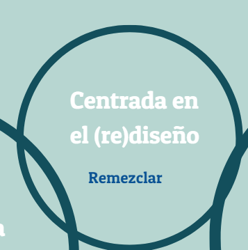

# (re)Diseño

Ilustración 1.5 Esta imagen se ha adaptado de una similar perteneciente al libro _Digital Literacies_. Cita: Dudeney, G., N. Hockly, y M. Pegrum. (2013). _Digital Literacies._ Harlow: Pearson.

Remezclar es una costumbre muy practicada en el mundo digital que consiste en tomar la creación de otra persona y convertirla en algo nuevo. La remezcla es el resultado de millones de personas creando contenido y publicando en la red. Música, imágenes, fragmentos de vídeo, comics, códigos de juegos, programas, etc. son parte del dominio público y están disponibles para la remezcla pero no todo el contenido de la red está disponible para su uso (en otro capítulo hablamos de las licencias Creative Commons). Las herramientas y proyectos de narración digital son a menudo remezclas de contenido de diversos creadores. Así por ejemplo Animoto, una herramienta gratuita de creación de vídeo con la que experimentaremos, ofrece una biblioteca de contenido creado por otros de forma que el usuario pueda crear un vídeo fantástico que integre música e imágenes.

