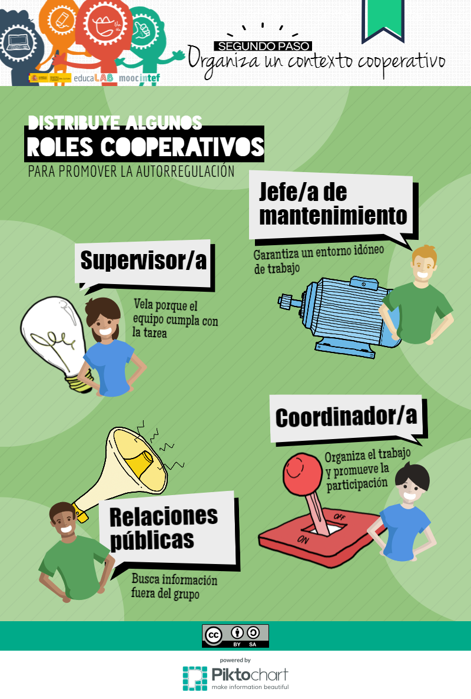

# Roles grupales

Cuando organizamos al alumnado en grupos debemos asignar a cada miembro un rol, una tarea y una responsabilidad que estén en línea con las necesidades del proyecto y sean necesarias para el éxito del grupo. Benne y Sheats (1948) sugieren diversos roles posibles, como iniciador/colaborador, investigador, informante, buscador de opinión, generador de opinión, elaborador, coordinador, orientador, evaluador/crítico, dinamizador, técnico logístico, secretario...

Tomando estas descripciones, podemos formar los distintos roles adaptados para nuestros proyectos de grupo. Antes de empezar, podemos realizar una actividad grupal de sinergia para que construyan su identidad de equipo utilizando [esta ficha de trabajo](ficha_tareas_grupo.pdf) para la organización inicial de la tarea y los roles. Los siguientes son roles designados para grupos de cuatro (cada miembro debe elegir solamente un rol):

_**Líder**_: Se asegura de que cada uno hace su parte y comprende la tarea, reparte tareas cuando los miembros no se ofrecen voluntarios y toma la decisión final si la votación no resuelve una cuestión. Se turnará con el organizador para introducir la información en los formularios on-line y se asegurará de que el grupo escuche al profesor cuando pida silencio.

_**Organizador**_: Se asegura de que todo el mundo participa, se turna con el líder para introducir la información en los formularios on-line, lee las instrucciones de todas las tareas y se asegura de que todos las comprenden.

**_Portador del proyecto:_** sube el trabajo del grupo a la carpeta**,** lo envía por correo y se asegura de que el trabajo está bien organizado y de que es lo mejor que puede hacer el grupo.  

**_Corresponsal:_** es el portavoz del grupo y toma notas cuando es necesario.  

Otra posible organización de roles es la propuesta en el **MOOC [Aprendizaje Cooperativo](http://mooc.educalab.es/courses/INTEF/INTEF168/2016_ED1/about)** del INTEF, que se observa en esta infografía:

